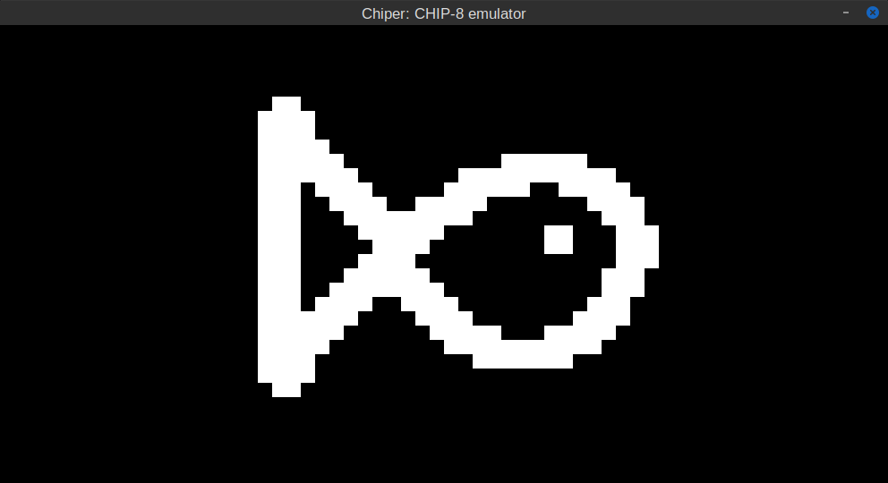
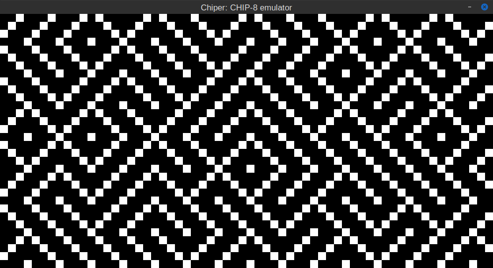

# Chiper
Yep, one more implementation of CHIP-8 emulator written in rust

## Demos

## Dependencies
To handle display and keyboard functionalities
[SDL2](https://www.libsdl.org/download-2.0.php) was used with [Rust
bindings](https://crates.io/crates/sdl2).

## Links
- https://en.wikipedia.org/wiki/CHIP-8
- https://chip-8.github.io/links/
- http://www.emulator101.com/chip-8-emulator.html
